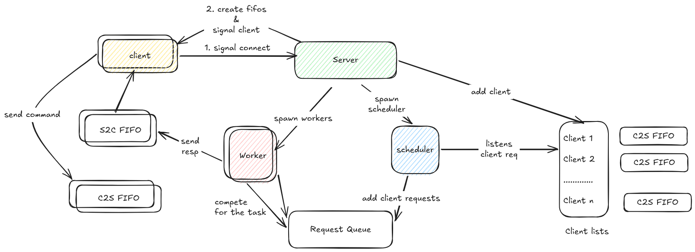

# Animate Server

A tool for making short animations from the terminal.

You build a scene by typing commands: create a canvas, add shapes (rectangles, circles, or images), place them, and give them a speed so they move. When you're happy, you render the scene into an MP4 video.

It's built as one server, many clients.

The server runs in the background and holds all the drawing state. It does the real work: rendering frames and exporting video. You start it once.

A client is a separate terminal program. It doesn't draw anything. It sends the commands you type to the server and prints the replies. You can run many clients at once, all talking to the same server.

Usually each client works on its own animation. But two clients can share a canvas and coordinate, so it's not just a single user tool.

## What you actually do

1. Start the server.
2. Open a client and log in with a username.
3. Create a canvas (your drawing board).
4. Create sprites (rectangles, circles, or image files) and place them on the canvas.
5. Set velocity and acceleration so they move over time.
6. Run `generate` to render frames and save a video file.
7. `Disconnect` when done.

That's the whole idea. Everything else is about making this work reliably with multiple clients hitting the server at once.

## Example

```bash
./animate_server 4
./animate_client <server_pid>
```

```
Login ExcitableFabricator
create_canvas 480 640 4278190080        # 480x640 blue canvas
create_rectangle 100 50 4294901760 1    # red filled rectangle
place_sprite 1 1 200 240                # put it on the canvas
set_animation_params 1 10 0 0 0         # move right at 10px/frame
generate 1 out 0 60 30                  # 2 sec video at 30fps to out.mp4
Disconnect
```

## Low level architecture


Here is what happens from the moment a client connects to the moment it gets a reply.

### Connecting

There is no socket. The client finds the server by its PID and they set up with signals:

1. The client sends `SIGUSR1` to the server.
2. The server reads the client's PID from the signal, then makes two pipes (FIFOs) named after it: one for client to server, one for server to client.
3. The server sends `SIGUSR2` back to say the pipes are ready.
4. The client opens both pipes and starts sending commands.

After that, every command and reply travels over those two pipes.

### Scheduler, queue, workers

Inside the server, three parts do the work.

The **scheduler** is one thread that watches every client's pipe. When a client sends a command, it reads it, tags it with a sequence number (its arrival order), and drops it on a shared queue.

The **queue** is a simple thread safe buffer sitting between the scheduler and the workers. The scheduler puts commands in, the workers take them out.

The **workers** are a pool of threads (you pick how many). Each one grabs a command from the queue, runs it, and sends the reply back to the client. Since there are many workers, several commands run at the same time.

### Keeping replies in order

Because workers run in parallel, a quick command can finish before an earlier slow one. To stop replies coming back scrambled, each client remembers which reply is next. A worker holds its reply until it's that command's turn, then writes it. So you always get replies in the same order you sent the commands.

### Doing the work

Running a command means calling the libanimate library (create a canvas, place a sprite, and so on). Each client has its own handles (1, 2, 3...) for the things it made, and later commands refer back to them. Replies are short codes: `0` is success, and negative numbers mean different kinds of error.

The full drawing API is documented in `libanimate/doc/PointerProAnimateRefman.pdf`.

`generate` is the big one. It renders each frame to a raw file, then runs `ffmpeg` on it to produce the `.mp4`.

### Sharing and cleanup

`share_canvas` lets another user draw on the same canvas. A `barrier` makes everyone sharing a canvas wait until they all reach the same point, so two people can stay in sync.

When a client leaves or crashes, the server tears down its shapes and canvases (a shared canvas stays alive if someone else still uses it), removes it from any barrier, and deletes its pipes.

## Commands

| Command | Args |
|---------|------|
| `Login` | username |
| `create_canvas` | height width color |
| `create_rectangle` | width height color filled |
| `create_circle` | radius color filled |
| `create_sprite` | filepath |
| `place_sprite` | canvas sprite x y |
| `set_animation_params` | placement vx vy ax ay |
| `generate` | canvas filename start end fps |
| `share_canvas` | canvas username |
| `barrier` | canvas |
| `destroy_canvas` / `destroy_sprite` / `destroy_placement` | handle |
| `Disconnect` | |

Create and place commands return a handle number (1, 2, 3...) you use in later commands.

Login reads from `users.txt`. A user needs a positive balance or they get rejected.

## Build

Linux, gcc, make, ffmpeg, and libanimate (put in `libanimate/`).

```bash
make
make clean   # remove binaries and FIFO files
```

## Files

| File | Role |
|------|------|
| `animate_server.c` | Server startup, signal handshake, thread creation |
| `animate_client.c` | Terminal client |
| `scheduler.c` | Reads from clients, fills the queue |
| `worker.c` | Runs commands, sends replies back in order |
| `queue.c` | Shared request queue |
| `rpc.c` | Command handlers and video export |
| `client.c` | Login, session state, cleanup |
| `barrier.c` | Sync for shared canvases |
